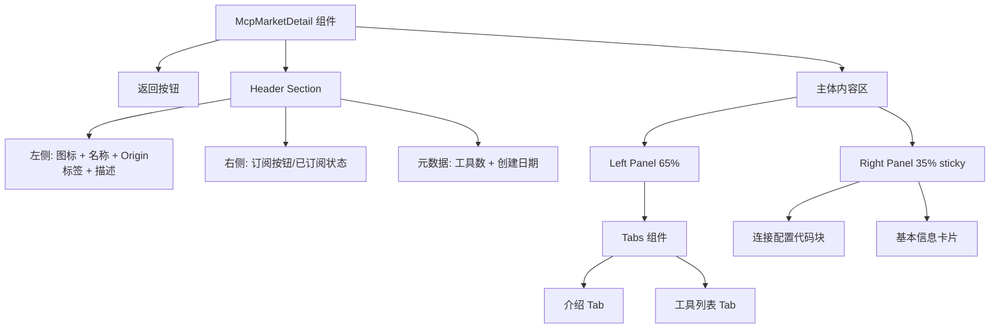

# 设计文档

## 概述

重写 `McpMarketDetail.tsx` 组件，将现有的渐变 Hero Banner + 上下布局替换为 ModelScope 风格的简洁白色头部 + 左右分栏 + Tab 切换布局。这是一个纯前端组件重构，不涉及 API 变更或新增接口。

核心设计决策：
- 单文件重写：所有改动集中在 `McpMarketDetail.tsx`，不拆分子组件（保持与现有代码风格一致）
- 复用现有 API：继续使用 `mcpMarket.ts` 中的 mock API 和类型定义
- 技术栈不变：React + TypeScript + Ant Design + Tailwind CSS

## 架构

页面整体结构如下：

```
┌─────────────────────────────────────────────────┐
│  返回按钮                                         │
├─────────────────────────────────────────────────┤
│  Header: 图标 | 名称 + Origin标签 + 元数据  | 订阅按钮 │
│          描述文本                                  │
├──────────────────────┬──────────────────────────┤
│  Left Panel (65%)    │  Right Panel (35%)        │
│  ┌─────────────────┐ │  ┌──────────────────────┐ │
│  │ Tab: 介绍 | 工具 │ │  │ 连接配置 (sticky)     │ │
│  ├─────────────────┤ │  ├──────────────────────┤ │
│  │                 │ │  │ 基本信息卡片           │ │
│  │  Tab 内容区域    │ │  │                      │ │
│  │                 │ │  └──────────────────────┘ │
│  └─────────────────┘ │                          │
└──────────────────────┴──────────────────────────┘
```



## 组件与接口

### McpMarketDetail 组件（重写）

文件路径：`src/pages/McpMarketDetail.tsx`

**State 管理（与现有一致）：**

```typescript
const [loading, setLoading] = useState(true);
const [cold, setCold] = useState<IMcpCold | null>(null);
const [subscribing, setSubscribing] = useState(false);
const [error, setError] = useState("");
const [mcpHot, setMcpHot] = useState<IMcpHot | null>(null);
const [activeTab, setActiveTab] = useState<"intro" | "tools">("intro");
```

**新增 `activeTab` state** 用于控制左侧 Tab 切换，其余 state 保持不变。

**关键函数（保持不变）：**
- `fetchDetail()` - 加载 MCP 详情
- `handleSubscribe()` - 订阅 MCP
- `handleCopy(text)` - 复制到剪贴板
- `parsedTools` - 解析 toolsConfig JSON

### 渲染结构

```typescript
// 伪代码 - 渲染结构
<Layout>
  <div className="max-w-6xl mx-auto">
    {/* 返回按钮 */}
    <BackButton />
    
    {/* Header Section - 白色卡片 */}
    <HeaderCard>
      <左侧>
        <MCP图标 />
        <名称 + OriginTag />
        <描述 />
        <元数据: 工具数 | 创建日期 />
      </左侧>
      <右侧>
        {cold.subscribed ? <已订阅Tag /> : <订阅Button />}
      </右侧>
    </HeaderCard>
    
    {/* 主体 - 左右分栏 */}
    <div className="flex gap-6">
      {/* Left Panel */}
      <div className="w-[65%]">
        <Tabs activeKey={activeTab} onChange={setActiveTab}>
          <TabPane key="intro">
            <IntroContent description={cold.description} />
          </TabPane>
          <TabPane key="tools">
            <ToolsTable tools={parsedTools} />
          </TabPane>
        </Tabs>
      </div>
      
      {/* Right Panel - sticky */}
      <div className="w-[35%] sticky top-4">
        <ConfigBlock cold={cold} mcpHot={mcpHot} />
        <InfoCard cold={cold} />
      </div>
    </div>
  </div>
</Layout>
```

### 工具列表表格

使用 Ant Design `Table` 组件替代现有的 `Collapse`：

```typescript
const toolColumns = [
  {
    title: '工具名称',
    dataIndex: 'name',
    render: (name: string) => <code className="font-mono">{name}</code>
  },
  {
    title: '描述',
    dataIndex: 'description',
  }
];

// 可展开行显示 inputSchema
const expandedRowRender = (tool: any) => {
  if (!tool.inputSchema) return null;
  return <pre>{JSON.stringify(tool.inputSchema, null, 2)}</pre>;
};
```

### 连接配置代码块

```typescript
// 未订阅时的占位配置
const placeholderConfig = {
  mcpServers: {
    [cold.name.toLowerCase().replace(/\s+/g, "-")]: {
      type: "sse",
      url: "https://example.com/mcp/your-endpoint/sse"
    }
  }
};

// 已订阅时的实际配置
const actualConfig = {
  mcpServers: {
    [cold.name.toLowerCase().replace(/\s+/g, "-")]: {
      type: mcpHot.endpointType.toLowerCase(),
      url: mcpHot.mcpEndpoint
    }
  }
};
```

## 数据模型

### 现有类型（无变更）

复用 `mcpMarket.ts` 中已定义的类型：

```typescript
// IMcpCold - MCP 冷数据（已存在，无需修改）
interface IMcpCold {
  id: number;
  name: string;
  description: string;
  icon: string;
  sourceType: string;
  sourceUrl: string;
  toolsConfig: string; // JSON: {"tools": [{name, description, inputSchema}]}
  origin: "ADMIN" | "GATEWAY" | "USER" | "THIRD_PARTY";
  subscribed: boolean;
  createdBy: string;
  createAt: string;
  // ... 其他字段
}

// IMcpHot - MCP 热数据（已存在，无需修改）
interface IMcpHot {
  endpointType: "SSE" | "HTTP" | "STDIO";
  mcpEndpoint: string;
  hotSource: "GATEWAY" | "AGENTRUN" | "USER_DIRECT";
  // ... 其他字段
}
```

### 工具解析类型（内部使用）

```typescript
// 从 toolsConfig JSON 解析出的工具结构
interface ParsedTool {
  name: string;
  description?: string;
  inputSchema?: {
    type: string;
    properties?: Record<string, {
      type: string;
      description?: string;
    }>;
    required?: string[];
  };
}
```

### Origin 映射（保持不变）

```typescript
const originMap: Record<string, { text: string; color: string }> = {
  ADMIN:       { text: "官方",     color: "orange" },
  GATEWAY:     { text: "网关",     color: "blue" },
  USER:        { text: "社区",     color: "purple" },
  THIRD_PARTY: { text: "第三方",   color: "pink" },
};
```


## 正确性属性

*正确性属性是一种在系统所有有效执行中都应成立的特征或行为——本质上是关于系统应该做什么的形式化陈述。属性是人类可读规范与机器可验证正确性保证之间的桥梁。*

由于本功能是 UI 组件重新设计，大部分验收标准涉及 UI 渲染和交互行为，更适合通过具体示例的单元测试来验证，而非属性测试。

经过分析，仅有一个验收标准适合属性测试：

Property 1: 连接配置 JSON 格式正确性
*For any* MCP 名称和端点 URL，生成的连接配置 JSON 对象应始终包含 `mcpServers` 顶层键，其值为以 MCP 名称（小写、空格替换为连字符）为键的对象，该对象包含 `type` 和 `url` 两个字段。
**Validates: Requirements 5.3**

## 错误处理

| 场景 | 处理方式 | 对应需求 |
|------|---------|---------|
| MCP 详情加载失败 | 显示 Alert 错误提示，包含错误信息 | 8.2 |
| mcpColdId 无效或 MCP 不存在 | 显示"MCP 不存在"错误页面 | 8.2 |
| 订阅 API 调用失败 | 通过 message.error 显示错误提示，保持原有状态 | 7.4 |
| toolsConfig JSON 解析失败 | 静默处理，返回空数组，显示空状态 | 3.4 |
| 剪贴板复制失败 | 依赖浏览器 API，无额外处理 | 5.5 |

错误处理逻辑与现有实现保持一致，不引入新的错误处理模式。

## 测试策略

### 单元测试

由于本功能是 UI 组件重新设计，测试重点在于验证渲染输出和交互行为的正确性。使用 Vitest + React Testing Library 进行组件测试。

关键测试用例：
1. **Header 渲染测试**：验证未订阅/已订阅状态下的 Header 内容差异（需求 1.2, 1.3）
2. **Tab 切换测试**：验证 Tab 切换后左侧内容变化、右侧内容不变（需求 2.2, 2.3）
3. **工具列表表格测试**：验证工具以表格形式展示，包含名称和描述列（需求 3.1）
4. **空状态测试**：验证 toolsConfig 为空和 description 为空时的占位显示（需求 3.4, 4.2）
5. **连接配置条件渲染测试**：验证未订阅/已订阅状态下的配置内容差异（需求 5.1, 5.2）
6. **订阅交互测试**：验证点击订阅按钮后的状态变化和配置更新（需求 7.1, 7.2）

### 属性测试

使用 fast-check 库进行属性测试，最少 100 次迭代。

- **Property 1**: 连接配置 JSON 格式正确性
  - 生成随机 MCP 名称和端点 URL
  - 验证生成的 JSON 对象结构符合规范
  - Tag: **Feature: mcp-detail-redesign, Property 1: 连接配置 JSON 格式正确性**
  - **Validates: Requirements 5.3**

### 测试配置

- 测试框架：Vitest
- 组件测试：@testing-library/react
- 属性测试：fast-check
- 每个属性测试最少 100 次迭代
