# HiMarket AI 开放平台 — 系统架构与功能文档

## 1. 平台概述

HiMarket 是基于 Higress AI 网关构建的企业级 AI 开放平台，帮助企业构建私有 AI 能力市场，统一管理和分发 LLM、MCP Server、Agent、Agent Skill 等 AI 资源。

平台将分散的 AI 能力封装为标准化的 API 产品，提供自助式开发者门户，并具备安全管控、观测分析等完整的企业级运营能力。

### 核心能力

- 多类型 AI 资源管理（LLM、MCP Server、Agent、Agent Skill、REST API）
- 标准化 API 产品封装与发布
- 自助式开发者门户（订阅、调试、凭证管理）
- 多网关集成（Higress、APIG、ADP AI Gateway、Apsara Gateway）
- AI 对话（HiChat）与 MCP 工具调用
- 在线编程（Coding）与远程沙箱执行
- 可观测性（模型用量大盘、MCP 监控）
- 开放 API（外部系统注册 MCP Server）

---

## 2. 系统架构

### 2.1 整体架构图

```
┌─────────────────────────────────────────────────────────────────────┐
│                        用户层 (User Layer)                          │
│  ┌──────────────────────┐    ┌──────────────────────────────────┐  │
│  │   管理后台 (Admin)    │    │     开发者门户 (Portal)           │  │
│  │   himarket-admin      │    │     himarket-frontend            │  │
│  │   React + Ant Design  │    │     React + Ant Design           │  │
│  │   :5174               │    │     + Tailwind CSS  :5173        │  │
│  └──────────┬───────────┘    └──────────────┬───────────────────┘  │
└─────────────┼───────────────────────────────┼──────────────────────┘
              │                               │
              ▼                               ▼
┌─────────────────────────────────────────────────────────────────────┐
│                    服务层 (Service Layer)                            │
│  ┌─────────────────────────────────────────────────────────────┐   │
│  │              himarket-server (Spring Boot 3.2)              │   │
│  │                                                             │   │
│  │  ┌──────────┐ ┌──────────┐ ┌──────────┐ ┌──────────────┐  │   │
│  │  │ Product  │ │   MCP    │ │  Chat    │ │  Consumer    │  │   │
│  │  │ Service  │ │ Service  │ │ Service  │ │  Service     │  │   │
│  │  └──────────┘ └──────────┘ └──────────┘ └──────────────┘  │   │
│  │  ┌──────────┐ ┌──────────┐ ┌──────────┐ ┌──────────────┐  │   │
│  │  │ Gateway  │ │ Sandbox  │ │  Portal  │ │  Open API    │  │   │
│  │  │ Service  │ │ Service  │ │ Service  │ │  Controller  │  │   │
│  │  └──────────┘ └──────────┘ └──────────┘ └──────────────┘  │   │
│  └─────────────────────────────────────────────────────────────┘   │
│                              :8081                                  │
└──────────────────────────────┬──────────────────────────────────────┘
                               │
              ┌────────────────┼────────────────┐
              ▼                ▼                ▼
┌─────────────────┐ ┌──────────────┐ ┌──────────────────────┐
│   MySQL / MariaDB│ │    Nacos     │ │   AI Gateway         │
│   himarket-dal   │ │  服务注册    │ │  (Higress/APIG/ADP)  │
│   JPA + Flyway   │ │  MCP 导入    │ │  路由 + 鉴权          │
└─────────────────┘ └──────────────┘ └──────────────────────┘
                                              │
                               ┌──────────────┼──────────────┐
                               ▼              ▼              ▼
                        ┌──────────┐  ┌──────────┐  ┌──────────────┐
                        │   LLM    │  │   MCP    │  │   Sandbox    │
                        │ Provider │  │  Server  │  │  (K8s CRD)   │
                        │ DashScope│  │  (远程)   │  │  代码执行     │
                        │ OpenAI   │  │          │  │              │
                        │ Gemini   │  │          │  │              │
                        └──────────┘  └──────────┘  └──────────────┘
```

### 2.2 技术栈

| 层级 | 技术 | 版本 | 说明 |
|------|------|------|------|
| 后端框架 | Spring Boot | 3.2.11 | 主框架 |
| 语言 | Java | 17 | LTS |
| ORM | Spring Data JPA + Hibernate | - | 数据持久化 |
| 数据库迁移 | Flyway | 10.15.0 | 版本化 SQL 迁移 |
| 数据库 | MariaDB / MySQL | 3.4.1 / 8.0.33 | 关系型存储 |
| 缓存 | Caffeine | 3.2.3 | 本地缓存 |
| 工具库 | Hutool | 5.8.33 | Java 工具集 |
| YAML 生成 | SnakeYAML | 2.0 | CRD YAML 生成 |
| K8s 客户端 | Fabric8 | 6.13.4 | K8s CRD 操作 |
| HTTP 客户端 | OkHttp | 4.12.0 | 外部 API 调用 |
| API 文档 | SpringDoc OpenAPI | 2.5.0 | Swagger UI |
| 代码格式化 | Spotless + Google Java Format | 1.28.0 | 统一代码风格 |
| AI SDK | DashScope / OpenAI / Google GenAI | 多版本 | LLM 对话 |
| 前端框架 | React | 19 | SPA |
| 前端语言 | TypeScript | - | 类型安全 |
| UI 组件库 | Ant Design | 5.x | 管理后台 + 门户 |
| CSS 框架 | Tailwind CSS | - | 门户页面样式 |
| 路由 | React Router | - | 前端路由 |
| 构建工具 | Vite | - | 前端构建 |
| 网关 | Higress / APIG / ADP AI Gateway / Apsara Gateway | 多版本 | AI 网关 |
| 注册中心 | Nacos | 3.1.0 | MCP 服务注册 |

### 2.3 模块结构

```
himarket/
├── himarket-dal/              # 数据访问层 (Data Access Layer)
│   └── entity/                #   24 个 JPA 实体
│   └── repository/            #   Spring Data JPA Repository
│   └── converter/             #   JPA AttributeConverter (JSON ↔ POJO)
│   └── support/               #   枚举、配置 POJO
│
├── himarket-server/           # 业务逻辑层 (Service Layer)
│   └── controller/            #   24 个 REST Controller
│   └── service/               #   业务服务接口 + 实现
│   │   └── impl/              #     核心服务实现
│   │   └── hichat/            #     AI 对话子系统 (LLM 适配)
│   │   └── gateway/           #     多网关适配 (策略模式)
│   │   └── mcp/               #     MCP 沙箱部署 (策略模式)
│   │   └── acp/               #     在线编程子系统 (WebSocket)
│   │   └── terminal/          #     终端服务
│   │   └── document/          #     文档服务
│   └── dto/                   #   请求参数 + 返回结果 DTO
│   └── core/                  #   通用组件 (鉴权、异常、工具)
│   └── config/                #   Spring 配置类
│
├── himarket-bootstrap/        # 启动模块
│   └── resources/
│       └── application.yml    #   应用配置
│       └── db/migration/      #   Flyway SQL 迁移 (V1 ~ V9)
│       └── crd-templates/     #   K8s CRD YAML 模板
│
├── himarket-web/              # 前端工程
│   └── himarket-admin/        #   管理后台 (React + Ant Design)
│   └── himarket-frontend/     #   开发者门户 (React + Ant Design + Tailwind)
│
└── deploy/                    # 部署配置
    └── docker/                #   Docker Compose 部署
    └── helm/                  #   Helm Chart 部署
```

---

## 3. 数据模型

### 3.1 实体关系总览

平台共有 24 个 JPA 实体，所有实体继承 `BaseEntity`（包含 `created_at`、`updated_at` 审计字段）。

```mermaid
erDiagram
    Administrator {
        Long id PK
        String adminId UK
        String username UK
        String passwordHash
    }

    Portal {
        Long id PK
        String portalId UK
        String name
        String adminId FK
        JSON portalSettingConfig
        JSON portalUiConfig
    }

    PortalDomain {
        Long id PK
        String portalId FK
        String domain UK
        Enum type
        Enum protocol
    }

    Developer {
        Long id PK
        String developerId UK
        String username
        String portalId FK
        Enum status
        Enum authType
    }

    DeveloperExternalIdentity {
        Long id PK
        String developerId FK
        String provider
        String subject
        Enum authType
    }

    Product {
        Long id PK
        String productId UK
        String adminId FK
        String name
        Enum type
        Enum status
        String description
        JSON icon
        JSON feature
    }

    ProductCategory {
        Long id PK
        String categoryId UK
        String name
        String adminId FK
    }

    ProductCategoryRelation {
        Long id PK
        String productId FK
        String categoryId FK
    }

    ProductRef {
        Long id PK
        String productId FK
        String gatewayId FK
        Enum sourceType
        JSON apiConfig
        JSON mcpConfig
        JSON modelConfig
    }

    ProductPublication {
        Long id PK
        String publicationId UK
        String portalId FK
        String productId FK
    }

    ProductSubscription {
        Long id PK
        String subscriptionId UK
        String productId FK
        String consumerId FK
        String developerId FK
        Enum status
        JSON consumerAuthConfig
    }

    Consumer {
        Long id PK
        String consumerId UK
        String name
        String portalId FK
        String developerId FK
        Boolean isPrimary
    }

    ConsumerCredential {
        Long id PK
        String consumerId FK_UK
        JSON apiKeyConfig
        JSON hmacConfig
        JSON jwtConfig
    }

    ConsumerRef {
        Long id PK
        String consumerId FK
        Enum gatewayType
        String gwConsumerId
        JSON gatewayConfig
    }

    Gateway {
        Long id PK
        String gatewayId UK
        String gatewayName
        Enum gatewayType
        String adminId FK
        JSON apigConfig
        JSON higressConfig
        JSON apsaraGatewayConfig
    }

    NacosInstance {
        Long id PK
        String nacosId UK
        String nacosName
        String serverUrl
        String adminId FK
    }

    McpServerMeta {
        Long id PK
        String mcpServerId UK
        String productId FK
        String displayName
        String mcpName
        String protocolType
        JSON connectionConfig
        String origin
        String publishStatus
        String createdBy
    }

    McpServerEndpoint {
        Long id PK
        String endpointId UK
        String mcpServerId FK
        String endpointUrl
        String hostingType
        String protocol
        String userId FK
        String status
        JSON subscribeParams
    }

    SandboxInstance {
        Long id PK
        String sandboxId UK
        String sandboxName
        String sandboxType
        String apiServer
        String namespace
        String status
    }

    ChatSession {
        Long id PK
        String sessionId UK
        String userId FK
        String name
        JSON products
    }

    Chat {
        Long id PK
        String chatId UK
        String sessionId FK
        String userId FK
        String productId FK
        String question
        String answer
        Enum status
        JSON toolCalls
        JSON chatUsage
    }

    ChatAttachment {
        Long id PK
        String attachmentId UK
        String userId FK
        Enum type
        String mimeType
        Blob data
    }

    SkillFile {
        Long id PK
        String productId FK
        String path
        String content
    }

    Administrator ||--o{ Portal : "管理"
    Portal ||--o{ PortalDomain : "绑定域名"
    Portal ||--o{ Developer : "注册"
    Developer ||--o{ DeveloperExternalIdentity : "外部身份"
    Developer ||--o{ Consumer : "创建"
    Consumer ||--|| ConsumerCredential : "凭证"
    Consumer ||--o{ ConsumerRef : "网关映射"
    Product ||--o{ ProductRef : "网关关联"
    Product ||--o{ ProductPublication : "发布到门户"
    Product ||--o{ ProductSubscription : "被订阅"
    Product ||--o| McpServerMeta : "MCP 元信息"
    McpServerMeta ||--o{ McpServerEndpoint : "运行时端点"
    Product ||--o{ ProductCategoryRelation : "分类"
    ProductCategory ||--o{ ProductCategoryRelation : "分类"
    ChatSession ||--o{ Chat : "包含对话"
    Product ||--o{ SkillFile : "技能文件"
```

### 3.2 核心表说明

| 表名 | 说明 | 数据特征 |
|------|------|----------|
| `administrator` | 管理员账号 | 低频写入 |
| `portal` | 开发者门户配置 | 低频写入 |
| `portal_domain` | 门户绑定域名 | 低频写入 |
| `developer` | 开发者账号 | 中频写入 |
| `developer_external_identity` | 开发者 OAuth2/OIDC 外部身份 | 低频写入 |
| `product` | API 产品（统一抽象） | 中频读写 |
| `product_category` | 产品分类 | 低频写入 |
| `product_category_relation` | 产品-分类关联 | 低频写入 |
| `product_ref` | 产品与网关/Nacos 的关联配置 | 中频读写 |
| `publication` | 产品发布到门户的记录 | 低频写入 |
| `product_subscription` | 开发者订阅产品记录 | 中频读写 |
| `consumer` | 消费者（API 调用方） | 中频读写 |
| `consumer_credential` | 消费者凭证（API Key / HMAC / JWT） | 低频写入 |
| `consumer_ref` | 消费者在网关侧的映射 | 低频写入 |
| `gateway` | 网关实例配置 | 低频写入 |
| `nacos_instance` | Nacos 实例配置 | 低频写入 |
| `mcp_server_meta` | MCP Server 元信息（冷数据） | 中频读，低频写 |
| `mcp_server_endpoint` | MCP Server 运行时端点（热数据） | 高频读写 |
| `sandbox_instance` | 沙箱实例（K8s 集群） | 低频写入 |
| `chat_session` | 对话会话 | 高频读写 |
| `chat` | 对话消息 | 高频读写 |
| `chat_attachment` | 对话附件（图片等） | 中频读写 |
| `skill_file` | Agent Skill 文件 | 低频读写 |


---

## 4. 功能模块详解

### 4.1 产品管理

产品（Product）是平台的核心抽象，所有 AI 资源统一封装为产品进行管理。

#### 产品类型

| 类型 | 枚举值 | 说明 |
|------|--------|------|
| REST API | `REST_API` | 传统 REST 接口 |
| 模型 API | `MODEL_API` | LLM 模型服务（DashScope、OpenAI、Gemini 等） |
| Agent API | `AGENT_API` | AI Agent 服务 |
| MCP Server | `MCP_SERVER` | Model Context Protocol 服务 |
| Agent Skill | `AGENT_SKILL` | Agent 技能包（可上传文件） |

#### 产品状态流转

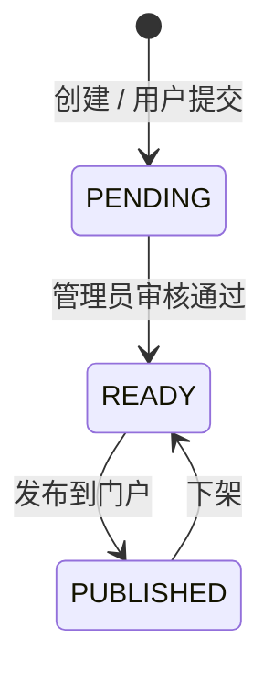

#### 产品关联关系

每个产品通过 `ProductRef` 关联到网关和 Nacos：

- `gatewayId` → 关联的网关实例
- `sourceType` → 数据来源（`GATEWAY` / `NACOS` / `MANUAL`）
- `apiConfig` / `mcpConfig` / `modelConfig` / `agentConfig` → 不同类型产品的网关侧配置（JSON）

#### 产品分类

支持自定义分类标签，通过 `ProductCategory` + `ProductCategoryRelation` 多对多关联。


### 4.2 MCP Server 管理

MCP（Model Context Protocol）是平台的核心功能模块，采用冷热数据分离设计。

#### 冷热数据分离

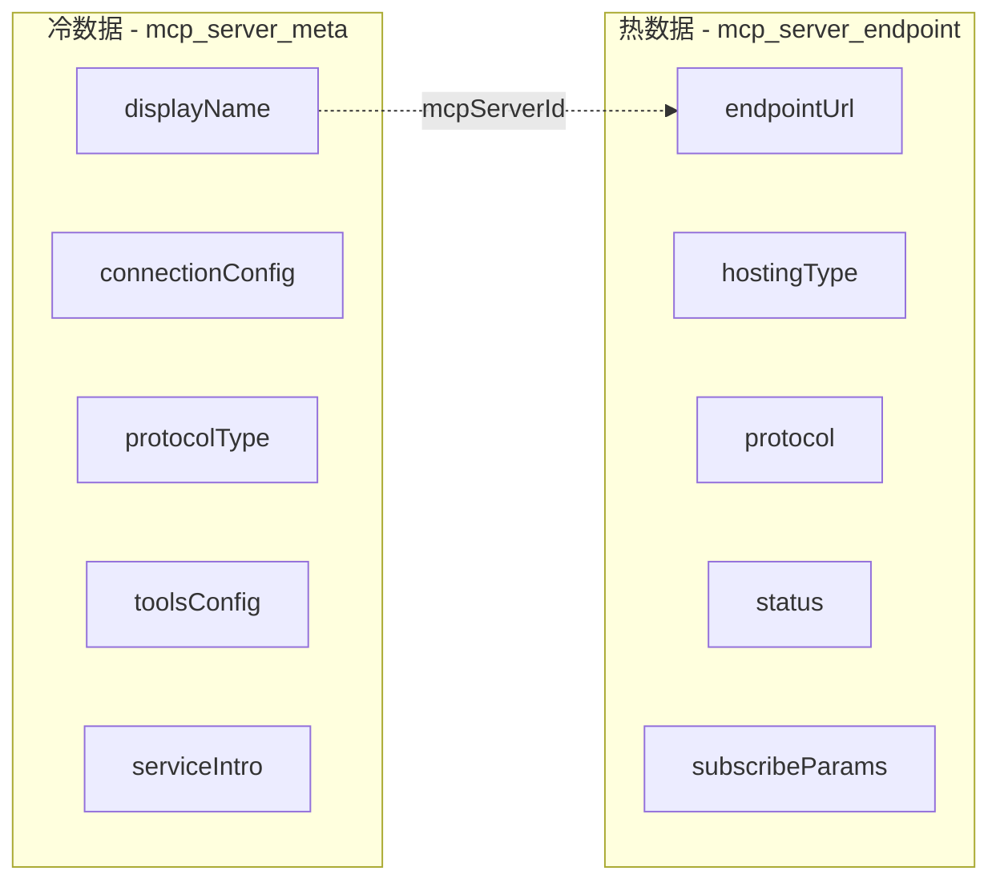

- 冷数据（`mcp_server_meta`）：MCP 的完整配置、展示信息、文档，由管理员配置，写入频率低
- 热数据（`mcp_server_endpoint`）：运行时连接信息，每次用户订阅时写入，查询频率高

#### 多协议支持

`protocolType` 支持逗号分隔的多值，如 `"stdio,sse"`，表示同一个 MCP Server 支持多种连接协议。

`connectionConfig` 是 JSON 格式，使用 `McpConnectionConfig` POJO 解析，结构示例：

```json
{
  "mcpServers": {
    "my-server": {
      "url": "https://mcp.example.com/sse",
      "command": "npx",
      "args": ["-y", "@example/mcp-server"],
      "env": { "API_KEY": "xxx" }
    }
  }
}
```

#### 订阅流程

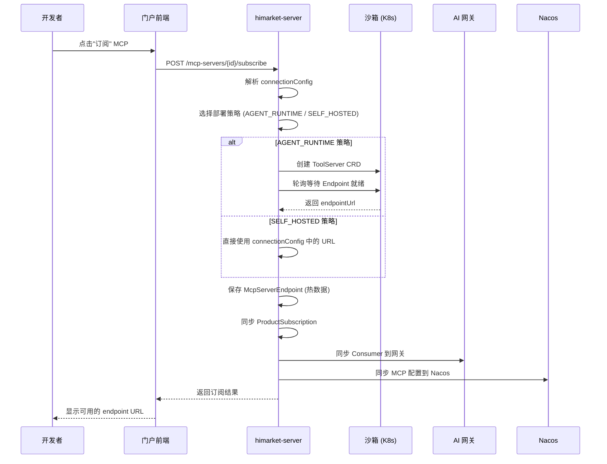


#### 沙箱部署策略（策略模式）

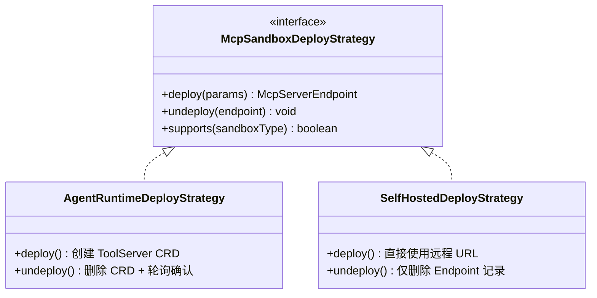

- `AGENT_RUNTIME`：通过 K8s CRD（ToolServer）在沙箱集群中部署 MCP Server 容器，支持 stdio 和 sse 两种 CRD 模板
- `SELF_HOSTED`：MCP Server 已在外部运行，直接使用其 URL，无需部署

#### CRD 模板

CRD YAML 模板位于 `resources/crd-templates/`，使用 SnakeYAML 动态生成：

- `toolserver-stdio.yaml`：stdio 协议 MCP Server
- `toolserver-sse.yaml`：SSE 协议 MCP Server

模板中的 `env` 字段从用户提交的 `subscribeParams` 和 `connectionConfig.env` 中提取。

#### MCP 来源

| 来源 | origin 值 | 说明 |
|------|-----------|------|
| 网关导入 | `GATEWAY` | 从 Higress/APIG 等网关导入 |
| Nacos 导入 | `NACOS` | 从 Nacos 注册中心导入 |
| 管理员手动创建 | `MANUAL` | 管理后台手动配置 |
| 开放 API 注册 | `OPEN_API` | 外部系统通过 Open API 注册 |
| AgentRuntime 注册 | `AGENTRUNTIME` | AgentRuntime 系统自动注册 |
| 用户提交 | `USER` | 开发者门户用户提交（PENDING 状态） |


### 4.3 AI 对话（HiChat）

HiChat 是平台内置的 AI 对话功能，支持多模型、多轮对话、MCP 工具调用。

#### 架构设计

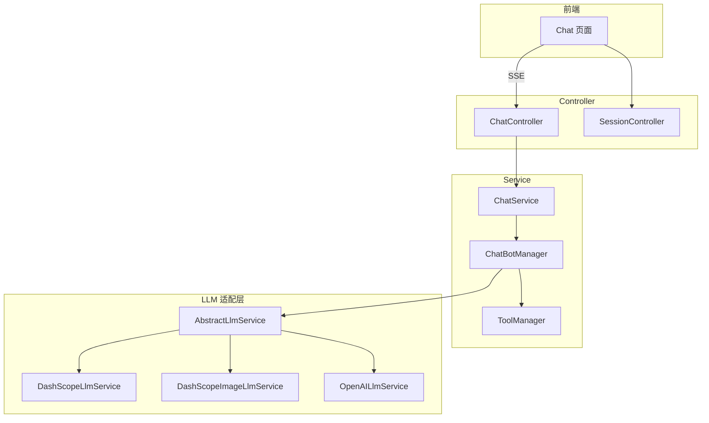

#### 核心流程

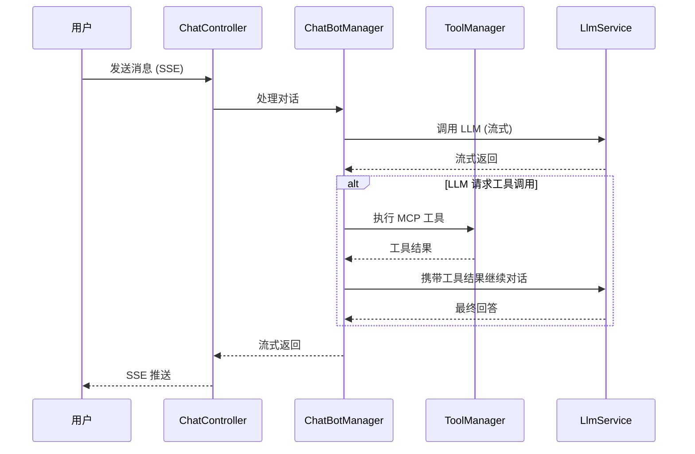

#### 支持的 LLM 提供商

| 提供商 | 服务类 | 说明 |
|--------|--------|------|
| DashScope（通义千问） | `DashScopeLlmService` | 阿里云 AI 服务 |
| DashScope 图像 | `DashScopeImageLlmService` | 多模态图像理解 |
| OpenAI | `OpenAILlmService` | GPT 系列 |

#### MCP 工具集成

HiChat 通过 `ToolManager` 集成用户已订阅的 MCP Server 工具：

1. 用户在 Chat 中选择要使用的 MCP Server
2. `ToolManager` 从 `McpServerEndpoint` 获取已订阅的 endpoint
3. 将 MCP 工具列表注入 LLM 的 function calling 参数
4. LLM 返回 tool_call 时，`ToolManager` 调用对应 MCP endpoint 执行工具
5. 工具结果回传 LLM 继续对话


### 4.4 在线编程（Coding）

Coding 模块提供浏览器内的 AI 辅助编程体验，通过 WebSocket 连接 CLI 工具。

#### 架构设计

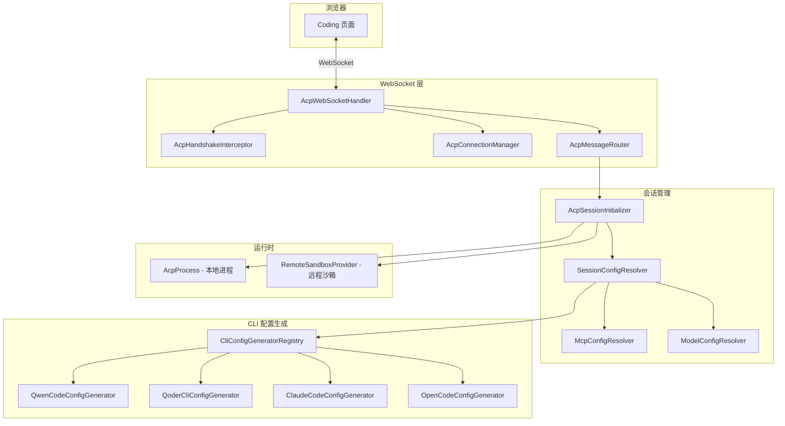

#### 支持的 CLI 提供商

| 提供商 | 命令 | 运行时 | 特性 |
|--------|------|--------|------|
| Qwen Code | `qwen --acp` | LOCAL / REMOTE | 自定义模型、MCP、Skill |
| Qoder CLI | `qodercli --acp` | LOCAL / REMOTE | Personal Access Token 认证 |
| Claude Code | `npx @zed-industries/claude-code-acp` | LOCAL / REMOTE | 自定义模型、MCP、Skill |
| OpenCode | `opencode acp` | LOCAL / REMOTE | 自定义模型、MCP、Skill |

#### 运行时模式

- `LOCAL`：在 himarket-server 本机启动 CLI 子进程，工作目录为 `{workspace-root}/{userId}`
- `REMOTE`：连接远程沙箱容器（sandbox-shared），通过 HTTP API 在容器内执行 CLI

#### MCP 与 Skill 注入

Coding 会话启动时，`McpConfigResolver` 自动将用户已订阅的 MCP endpoint 注入 CLI 配置文件，使 CLI 工具可以调用 MCP Server 的工具能力。同理，`ModelConfigResolver` 注入自定义模型配置。


### 4.5 网关管理

平台支持多种 AI 网关的统一管理，采用策略模式适配不同网关。

#### 网关适配架构

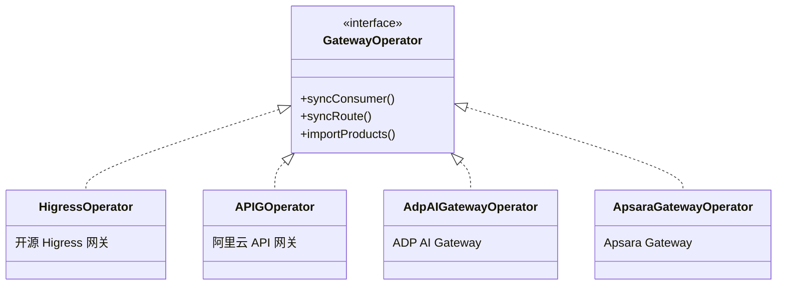

#### 支持的网关类型

| 网关 | 枚举值 | 说明 |
|------|--------|------|
| Higress | `HIGRESS` | 开源 AI 网关，支持 MCP 协议 |
| APIG | `APIG` | 阿里云 API 网关 |
| ADP AI Gateway | `ADP_AI_GATEWAY` | ADP 平台 AI 网关 |
| Apsara Gateway | `APSARA_GATEWAY` | 专有云网关 |

#### 网关核心功能

- 产品导入：从网关导入已有的 API/MCP/Model 路由，自动创建 Product
- Consumer 同步：用户订阅产品时，自动在网关侧创建/更新 Consumer 和鉴权规则
- 路由管理：产品发布时同步路由配置到网关

### 4.6 沙箱管理

沙箱（Sandbox）是 MCP Server 的运行环境，管理 K8s 集群信息。

#### 沙箱类型

| 类型 | 枚举值 | 说明 |
|------|--------|------|
| Agent Runtime | `AGENT_RUNTIME` | 通过 K8s CRD 部署 MCP Server 容器 |
| 自托管 | `SELF_HOSTED` | MCP Server 已在外部运行，仅记录连接信息 |

#### 沙箱状态

| 状态 | 说明 |
|------|------|
| `RUNNING` | 沙箱正常运行 |
| `STOPPED` | 沙箱已停止 |
| `ERROR` | 沙箱异常 |

#### 沙箱管理流程

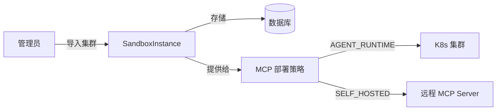

管理员在后台导入 K8s 集群信息（apiServer、namespace、kubeConfig），系统通过 Fabric8 K8s Client 操作 CRD。


### 4.7 开发者门户

开发者门户（Portal）是面向外部开发者的自助服务平台。

#### 门户页面结构

| 页面 | 路由 | 说明 |
|------|------|------|
| AI 对话 | `/chat` | HiChat 对话（默认首页） |
| 在线编程 | `/coding` | AI 辅助编程 |
| MCP 广场 | `/mcp` | MCP Server 市场 |
| 创建 MCP | `/mcp/create` | 用户提交 MCP Server |
| MCP 详情 | `/mcp/:mcpProductId` | MCP Server 详情 + 订阅 |
| 模型广场 | `/models` | LLM 模型市场 |
| Agent 广场 | `/agents` | Agent 市场 |
| API 广场 | `/apis` | REST API 市场 |
| Skill 广场 | `/skills` | Agent Skill 市场 |
| 我的应用 | `/consumers` | 消费者管理 + 凭证 |
| 个人中心 | `/profile` | 用户信息 |
| 入门指南 | `/getting-started` | 使用引导 |

#### 开发者认证

支持多种认证方式：

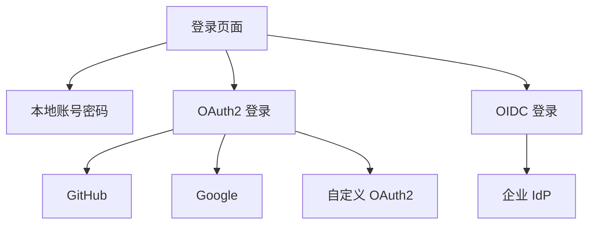

- 本地认证：用户名 + 密码，JWT Token
- OAuth2：GitHub、Google 等第三方登录
- OIDC：企业身份提供商（IdP）集成

#### 订阅与凭证

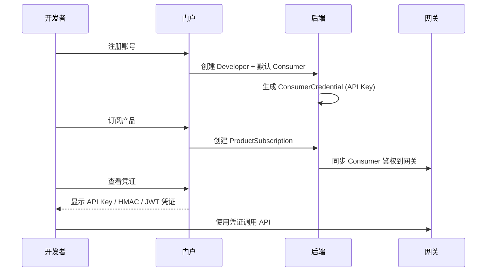

#### 消费者凭证类型

| 类型 | 说明 |
|------|------|
| API Key | 简单的 Key 认证 |
| HMAC | 基于签名的认证 |
| JWT | JSON Web Token 认证 |


### 4.8 可观测性

平台集成阿里云 SLS（日志服务）提供可观测能力。

#### 功能模块

| 功能 | 说明 |
|------|------|
| 模型用量大盘 | 统计各模型 API 的调用量、Token 消耗、延迟 |
| MCP 监控 | 监控 MCP Server 的调用情况 |
| 访问日志 | 网关侧的 API 访问日志分析 |

#### 技术实现

- 通过 `SlsLogService` 对接阿里云 SLS
- 支持 AK/SK 和 STS 两种认证方式
- 日志数据来源于网关的 access-log（通过 AliyunLogConfig CRD 配置采集）
- 前端通过 `SlsController` 查询日志数据并可视化展示

### 4.9 开放 API

开放 API 允许外部系统（如 AgentRuntime）通过 HTTP 接口注册和查询 MCP Server。

#### 认证方式

使用 `X-API-Key` Header 认证，Key 通过环境变量 `OPEN_API_KEY` 配置。

#### 接口列表

| 方法 | 路径 | 说明 |
|------|------|------|
| POST | `/open-api/mcp-servers/register` | 注册 MCP Server |
| GET | `/open-api/mcp-servers/list` | 分页查询列表（精简信息） |
| GET | `/open-api/mcp-servers/{mcpServerId}` | 查询详情 |
| GET | `/open-api/mcp-servers/by-name` | 按名称查询 |
| GET | `/open-api/mcp-servers/by-origin` | 按来源查询 |

#### 安全设计

- 列表查询返回 `McpMetaSimpleResult`（精简字段，不含敏感信息）
- 详情查询返回 `McpMetaDetailResult`（不暴露 `productId` 和 `connectionConfig`）
- 注册接口支持 `origin`（来源标识）和 `createdBy`（外部系统用户 ID）字段

详细接口文档参见 [Open API 接口文档](./open-api-mcp-servers.md)。


---

## 5. 核心使用流程

### 5.1 MCP Server 全生命周期

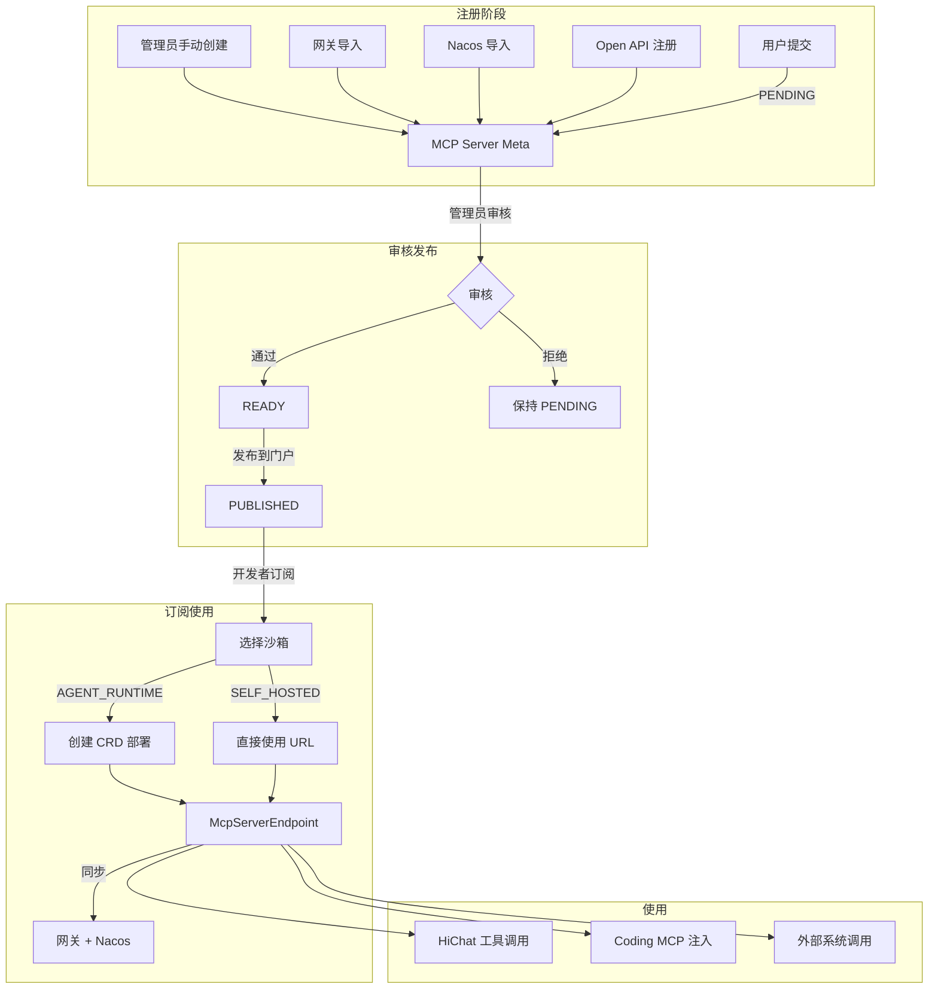

### 5.2 开发者使用流程

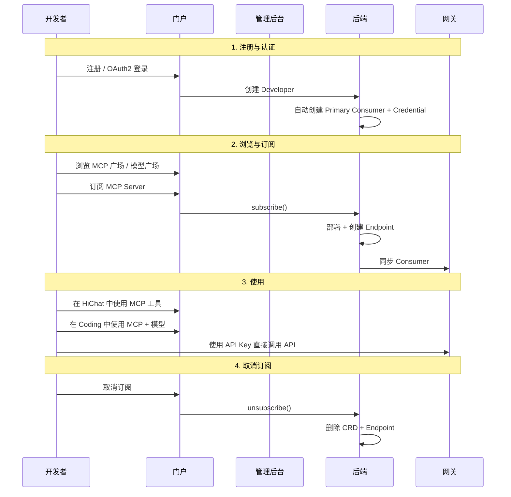


### 5.3 管理员操作流程

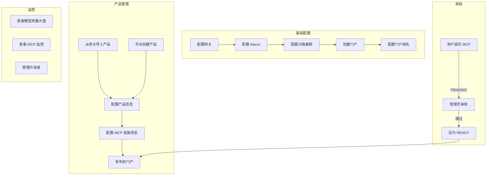

---

## 6. 部署架构

### 6.1 Docker Compose 部署

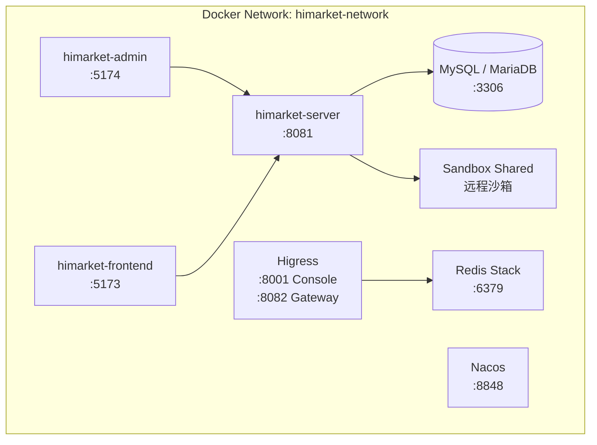

#### 部署 Profile

| Profile | 组件 | 说明 |
|---------|------|------|
| `builtin-mysql` | MySQL | 内置 MySQL，可选外部数据库 |
| `opensource-nacos` | Nacos | 开源 Nacos，可选商业化 Nacos |
| `higress-gateway` | Higress + Redis | 开源 Higress 网关 |
| (默认) | Server + Admin + Frontend + Sandbox | 核心服务，始终部署 |

### 6.2 Helm Chart 部署

支持 Kubernetes 集群部署，Helm Chart 位于 `deploy/helm/`，包含：

- himarket-server Deployment + Service + ConfigMap
- himarket-admin Deployment + Service + ConfigMap
- himarket-frontend Deployment + Service + ConfigMap
- MySQL StatefulSet（可选）
- Nacos StatefulSet（可选）

### 6.3 环境变量配置

| 变量 | 默认值 | 说明 |
|------|--------|------|
| `DB_HOST` | `localhost` | 数据库地址 |
| `DB_PORT` | `3306` | 数据库端口 |
| `DB_NAME` | `himarket` | 数据库名 |
| `DB_USERNAME` | `root` | 数据库用户 |
| `DB_PASSWORD` | `12345678` | 数据库密码 |
| `ACP_DEFAULT_RUNTIME` | `remote` | Coding 运行时模式 |
| `ACP_REMOTE_HOST` | `sandbox-shared` | 远程沙箱地址 |
| `OPEN_API_KEY` | `himarket-open-api-key` | 开放 API 密钥 |
| `SLS_ENDPOINT` | (空) | SLS 日志服务端点 |


---

## 7. 认证与安全

### 7.1 认证体系

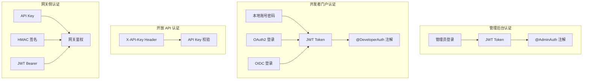

### 7.2 认证注解

| 注解 | 作用域 | 说明 |
|------|--------|------|
| `@AdminAuth` | 方法级 | 管理员接口鉴权，校验 JWT Token |
| `@DeveloperAuth` | 方法级 | 开发者接口鉴权，校验 JWT Token |

注意：认证注解使用方法级别，不使用类级别，以便灵活控制每个接口的鉴权策略。

### 7.3 全局响应封装

后端通过 `ResponseAdvice` 统一封装所有 Controller 返回值：

```json
{
  "code": "SUCCESS",
  "data": { ... }
}
```

前端 Axios 响应拦截器自动解包：`return response.data`，业务代码直接使用 `data` 字段。

### 7.4 数据安全

- 管理员密码使用 BCrypt 哈希存储
- 开发者密码使用 BCrypt 哈希存储
- Consumer 凭证（API Key、HMAC Secret）使用 AES 加密存储，根密钥通过 `encryption.root-key` 配置
- K8s kubeConfig 存储在数据库中，不创建 K8s Secret
- Open API 查询接口不暴露 `productId` 和 `connectionConfig` 等敏感信息

---

## 8. API 接口总览

### 8.1 管理后台 API

| Controller | 路径前缀 | 说明 |
|------------|----------|------|
| `AdministratorController` | `/administrators` | 管理员账号管理 |
| `PortalController` | `/portals` | 门户管理 |
| `ProductController` | `/products` | 产品 CRUD |
| `ProductCategoryController` | `/product-categories` | 产品分类 |
| `GatewayController` | `/gateways` | 网关管理 |
| `NacosController` | `/nacos` | Nacos 实例管理 |
| `ConsumerController` | `/consumers` | 消费者管理 |
| `McpServerController` | `/mcp-servers` | MCP Server 管理 |
| `SandboxController` | `/sandboxes` | 沙箱管理 |
| `SlsController` | `/sls` | 日志服务 |
| `SkillController` | `/skills` | Agent Skill 管理 |

### 8.2 开发者门户 API

| Controller | 路径前缀 | 说明 |
|------------|----------|------|
| `DeveloperController` | `/developers` | 开发者注册/登录 |
| `OAuth2Controller` | `/oauth2` | OAuth2 认证 |
| `OidcController` | `/oidc` | OIDC 认证 |
| `SessionController` | `/sessions` | 对话会话管理 |
| `ChatController` | `/chat` | AI 对话 (SSE) |
| `AttachmentController` | `/attachments` | 对话附件上传 |
| `RuntimeController` | `/runtime` | Coding 运行时 |
| `CliProviderController` | `/cli-providers` | CLI 提供商列表 |
| `WorkspaceController` | `/workspaces` | 工作空间管理 |
| `FileSyncController` | `/file-sync` | 文件同步 |
| `SearchEngineController` | `/search` | 搜索服务 |

### 8.3 开放 API

| Controller | 路径前缀 | 说明 |
|------------|----------|------|
| `OpenApiMcpController` | `/open-api/mcp-servers` | 外部 MCP 注册与查询 |

---

## 9. 数据库迁移版本

| 版本 | 文件 | 说明 |
|------|------|------|
| V1 | `V1__Create_baseline_schema.sql` | 基线 Schema（产品、网关、门户、开发者、消费者等） |
| V2 | `V2__Migrate_to_v1_0_5.sql` | 1.0.5 版本迁移 |
| V3 | `V3__Add_chat_tables.sql` | 新增对话表（chat_session、chat） |
| V4 | `V4__Optimize_resource_definition.sql` | 优化资源定义 |
| V5 | `V5__Fix_chat_attachment.sql` | 修复对话附件表 |
| V6 | `V6__Add_chat_tool_calls.sql` | 新增对话工具调用字段 |
| V7 | `V7__Add_sandbox_instance.sql` | 新增沙箱实例表 |
| V8 | `V8__Add_skill_file_table.sql` | 新增 Skill 文件表 |
| V9 | `V9__Add_mcp_server_tables.sql` | 新增 MCP Server 冷热数据表 |

